# ⚡ Abdessamad Cherkaoui — Engineering Portfolio

[](https://portfolio-ten-zeta-y2ibotfr2g.vercel.app/)
[](https://github.com/Cherkaoui7/portfolio)
[](#-architectural-philosophy)
[](#-ultra-responsive-engine--mobile-performance)
[](#-application-security--red-team-hardening)
[](https://www.linkedin.com/in/cherkaoui-abdessamad-750294212/)
[](https://mail.google.com/mail/?view=cm&fs=1&to=cherkaouiabdessamad9@gmail.com)

> A modern, ultra-fast personal portfolio engineered for **maximum performance**, **semantic SEO discoverability**, and **cybernetic visual aesthetics**. Features an authentic **Monokai terminal code engine**, an **interactive neural plexus constellation** for academic milestones, a **dual-mode Tech Stack Ecosystem** (desktop interactive SVG cyber-rain canvas & mobile vertical spine layout), **3D holographic CSS project visualizers**, a **zero-reload bilingual engine (EN / FR)**, an integrated **CV download hub**, and enterprise-grade **Content Security Policy (CSP)** hardening.

---

## 📑 Table of Contents

1. [🌟 Architectural Philosophy](#-architectural-philosophy)
2. [🌐 Live Deployments &amp; Production Demos](#-live-deployments--production-demos)
3. [⚡ Core Features &amp; Interactive Showcase](#-core-features--interactive-showcase)
   - [1. Monokai Hero Code Engine](#1-monokai-hero-code-engine)
   - [2. Neural Constellation Network (Education)](#2-neural-constellation-network-education)
   - [3. Dual-Mode Tech Stack Ecosystem](#3-dual-mode-tech-stack-ecosystem)
     - [Desktop: Interactive Radial Mind Map &amp; Cyber Rain](#desktop--768px-interactive-radial-mind-map--cyber-rain)
     - [Mobile: Vertical Glowing Spine &amp; Tech Pillars](#mobile--768px-vertical-glowing-spine--tech-pillars)
   - [4. 3D Holographic Project Visual Simulations](#4-3d-holographic-project-visual-simulations)
   - [5. Zero-Reload Multilingual Engine (EN / FR)](#5-zero-reload-multilingual-engine-en--fr)
   - [6. Bilingual CV Hub &amp; Download Center](#6-bilingual-cv-hub--download-center)
   - [7. Precision Micro-Interactions &amp; Physics](#7-precision-micro-interactions--physics)
4. [📱 Ultra-Responsive Engine &amp; Mobile Performance](#-ultra-responsive-engine--mobile-performance)
5. [🔍 Semantic SEO &amp; Search Engine Discoverability](#-semantic-seo--search-engine-discoverability)
6. [🛡️ Application Security &amp; Red-Team Hardening](#-application-security--red-team-hardening)
7. [🎓 Academic Background &amp; Credentials](#-academic-background--credentials)
8. [💼 Featured Production Projects](#-featured-production-projects)
9. [📁 Project Structure &amp; Codebase Map](#-project-structure--codebase-map)
10. [💻 Local Development &amp; Setup](#-local-development--setup)
11. [🚢 Deployment Workflow](#-deployment-workflow)
12. [📬 Contact &amp; Professional Inquiries](#-contact--professional-inquiries)

---

## 🌟 Architectural Philosophy

The portfolio was engineered under a strict **zero-bloat, static-first, progressive enhancement** mindset:

- **Zero NPM Dependencies at Runtime:** No React, Next.js, Vue, Tailwind CSS, GSAP, Framer Motion, or Three.js bundle overhead.
- **Sub-Second First Contentful Paint (FCP):** Inlined critical CSS, self-contained SVG vectors, asynchronous non-critical scripts (`defer`), and zero render-blocking requests.
- **Hardware-Accelerated 60 FPS Animations:** Animations strictly utilize `transform` and `opacity` to run exclusively on the GPU compositor thread without triggering layout reflows.
- **Adaptive Resource Throttling:** Detects device capabilities (`pointer: coarse`, mobile viewports) to automatically disable heavy 3D floors and background canvas `requestAnimationFrame` loops on mobile devices.

---

## 🌐 Live Deployments & Production Demos

| Application                    | Role & Architecture                               | Stack                                      | Live URL                                                                      | Source Code                                         |
| :----------------------------- | :------------------------------------------------ | :----------------------------------------- | :---------------------------------------------------------------------------- | :-------------------------------------------------- |
| **Official Portfolio**   | Personal Developer Portfolio & AI Engineering Hub | HTML5, CSS3, Vanilla JS, SVG, Canvas 2D    | [🔗 Live on Vercel](https://portfolio-ten-zeta-y2ibotfr2g.vercel.app/)         | [GitHub](https://github.com/Cherkaoui7/portfolio)    |
| **JobFinder AI**         | BYOK Job Aggregator & Mistral AI Resume Matcher   | React, Node.js, Mistral AI, SerpApi        | [🔗 ai-job-finder-orcin.vercel.app](https://ai-job-finder-orcin.vercel.app/)   | [GitHub](https://github.com/Cherkaoui7/AiJobFinder)  |
| **Assurances Cherkaoui** | Production Insurance Brokerage Platform           | MERN Stack (MongoDB, Express, React, Node) | [🔗 assurances-cherkaoui.vercel.app](https://assurances-cherkaoui.vercel.app/) | [GitHub](https://github.com/Cherkaoui7/assurance_ch) |
| **AURORA Store**         | Modern eCommerce Platform with Spring Physics     | React, Express, MongoDB, Node.js           | [🔗 aurorastore-six.vercel.app](https://aurorastore-six.vercel.app/)           | [GitHub](https://github.com/Cherkaoui7/aurora_store) |
| **ArchivePro**           | Public Sector Archiving Solution (Agdal-Ryad)     | Offline-First PWA, IndexedDB, SheetJS      | [🔗 archivesemp.netlify.app](https://archivesemp.netlify.app/)                 | [GitHub](https://github.com/Cherkaoui7/archive_emp)  |
| **DOMINATORES 3D**       | Luxury 3D Real Estate & Interactive Floorplans    | Three.js, React 18, Laravel 10, Sanctum    | *Private Client Preview*                                                    | [GitHub](https://github.com/Cherkaoui7/event)        |

---

## ⚡ Core Features & Interactive Showcase

### 1. Monokai Hero Code Engine

- **Authentic Monokai Syntax:** Highlights object declarations, strings, arrays, keys, and values according to standard Monokai hexadecimal tokens (`#f92672`, `#a6e22e`, `#66d9ef`, `#e6db74`, `#75715e`).
- **macOS Window Frame:** Interactive header with traffic light window controls and active file indicator (`portfolio.js`).
- **Dynamic Syntax Injection:** Reflects developer metadata, production specialties, and technical proficiencies.

### 2. Neural Constellation Network (Education)

- **Living HTML5 Canvas 2D Mesh:** Generates 38 synaptic nodes connected by dynamic proximity-based connecting lines.
- **Physics Interaction:** Interactive mouse repulsion field that pushes nodes away gently upon cursor hover with elastic restitution.
- **Automatic Mobile Offloading:** Automatically unmounts canvas rendering loops on viewports `<= 768px` to save mobile battery life and eliminate composite recalculation.

### 3. Dual-Mode Tech Stack Ecosystem

The skills section adapts dynamically depending on whether the user is on desktop or mobile:

#### Desktop (> 768px): Interactive Radial Mind Map & Cyber Rain

- **1536×1024 Scaled SVG Scene:** Radial layout with 4 distinct colored sectors branching out from an illuminated central core hub.
- **Cyber Data Rain Canvas (`#mindmapRainCanvas`):** 75 luminous particles streaming downward at varying depth velocities with glowing heads, trailing streaks, and interactive mouse-breeze deflection.
- **Drag-to-Explore Interaction:** Custom mouse drag-and-scroll controller allowing smooth horizontal navigation across high-resolution screens.

#### Mobile (<= 768px): Vertical Glowing Spine & Tech Pillars

- **Curved Neon Spine (`.mv-spine-svg`):** Dotted vertical gradient curve running through the 4 category nodes.
- **4 Circular Glowing Category Nodes:**
  - 🌐 **Frontend (Cyan - `#00f0ff`):** `</>` Code icon, title, subtitle, and horizontal connector dot.
  - ⚙️ **Backend (Purple - `#b026ff`):** Server icon, title, subtitle, and connector dot.
  - 🗄️ **Database & Tools (Turquoise - `#00e5a3`):** Cylinder database icon, title, subtitle, and connector dot.
  - ⭐ **Core Competencies (Amber - `#f59e0b`):** Star badge, title, subtitle, and connector dot.
- **Pill Grid Cards:** Glassmorphic rounded cards housing technology badges with custom SVGs and Devicon icons, optimized for multi-line wrapping and zero text truncation.

#### Resilient Icon Delivery & CSP Hardening Engine

To eliminate font-loading race conditions and ensure 100% icon availability across all network environments and security profiles:

- **Direct Stylesheet Linking (CSP Compliant):** Replaced legacy `<link rel="preload" onload="...">` patterns (which were blocked by strict `script-src 'self'` Content Security Policies on deployed sites) with standard `<link rel="stylesheet">` declarations.
- **Preconnected TLS Handshake:** Added `<link rel="preconnect" href="https://cdn.jsdelivr.net" crossorigin>` to establish early TCP/TLS handshakes for sub-millisecond CDN asset retrieval.
- **Explicit Font Rendering & Color Normalization:** Enforced `font-family: 'devicon' !important`, vertical centering, and custom brand colors in `style.css` (including `.figma i` `#f24e1e` and adaptive light/dark theme contrast for `.next i`).
- **Service Worker Opaque Caching (`cherkaoui-cache-v8`):** Upgraded `sw.js` to cache `type === 'opaque'` responses, enabling reliable offline storage for cross-origin font and stylesheet assets.
- **Self-Healing SVG Fallback Engine:** Integrated an autonomous client-side detector in `script.js` that checks font bounding boxes and injects crisp, multi-color vector SVGs if the external CDN is blocked by adblockers, strict corporate firewalls, or offline states.

### 4. 3D Holographic Project Visual Simulations

Each featured project includes a custom CSS3 3D animated visual preview:

- **JobFinder AI:** Multi-layer laser scanner HUD with oscillating beam, 98% AI compatibility meter, and telemetry data streams.
- **DOMINATORES:** Continuous rotating 3D isometric cube encased within a cosmic planetary orbit ring.
- **Assurances Cherkaoui:** Pulsing cybersecurity shield with multi-angle diagonal laser barrier rays.
- **AURORA Store:** Chromatic aurora borealis wave gradient animation glowing behind a floating glass card.
- **ArchivePro:** Digital matrix registry display featuring real-time animated frequency equalizer telemetry bars.

### 5. Zero-Reload Multilingual Engine (EN / FR)

- **Instant Client-Side I18n:** Built into [`lang.js`](./lang.js). Switches all textual content, tags, button labels, and system status indicators between English and French without reloading the page.
- **Symmetric Layout Preservation:** Translates without causing horizontal text overflow or visual misalignment.
- **Persistent State:** Automatically saves chosen language to `localStorage`.

### 6. Bilingual CV Hub & Download Center

- **Accessible CV Modal (`#cvModal`):** Triggered from the navigation bar, hero action button, or contact section.
- **Dual Formats:**
  - 🇫🇷 **Version Française:** `assets/CV Abdessamad Cherkaoui – Développeur Web Full-Stack.pdf`
  - 🇬🇧 **English Version:** `assets/Professional Full-Stack CV Abdessamad Cherkaoui.pdf`
- **Feedback Toast Notification:** Real-time download feedback toast with an animated progress bar and automatic dismissal.
- **Full Keyboard Accessibility:** Supports `Escape` key close, focus trapping, and background click dismiss.

### 7. Precision Micro-Interactions & Physics

- **Dual-Ring Custom Cursor:** Real-time trailing dot and spring-interpolated outer halo (automatically disabled on touch devices via `pointer: coarse`).
- **Magnetic Action Buttons:** Buttons softly pull toward cursor position within proximity radius (strictly isolated to mouse pointers via `pointer: fine` to prevent gesture cancellation on touchscreens).
- **3D Card Hover Tilt:** Gentle 3D perspective tilt calculations on desktop hover.
- **Dynamic Scroll Progress Bar:** Ambient progress indicator at the top of the viewport tracking reading depth.

---

## 📱 Ultra-Responsive Engine & Mobile Performance

The portfolio was engineered and verified across all standard viewport widths:

| Viewport Category                   | Screen Sizes Tested                        | Layout State                            | Mobile Performance Optimizations                            |
| :---------------------------------- | :----------------------------------------- | :-------------------------------------- | :---------------------------------------------------------- |
| **Ultra-Compact Mobile**      | 320px – 360px (iPhone SE 1st gen)         | Single column, compact pills            | Zero overflow, font clamp scaling, subtitle hidden on 320px |
| **Standard Mobile**           | 375px – 430px (iPhone 12/13/14/15, Pixel) | Vertical Tech Spine, full actions stack | 3D floor disabled, spinning rings hidden, static orb glow   |
| **Tablet Portrait**           | 768px – 820px (iPad 10th gen, iPad Air)   | 2-column metrics, wide vertical stack   | Canvas loops stopped, composite repaints reduced to 0       |
| **Tablet Landscape / Laptop** | 900px – 1024px (iPad Pro, Small Laptops)  | Desktop layout, scaled scene            | Drag hint indicator active, full navigation menu            |
| **Desktop Monitors**          | 1280px – 1920px+ (FHD & 4K Displays)      | Full 1536x1024 radial ecosystem         | 60 FPS cyber data rain, active neural mesh, 3D tilt         |

### Mobile Resource Optimizations & Touch Hardening:

1. **Disabled 3D Floor:** `transform: perspective(...)` floor grid is completely unmounted on `<= 768px`.
2. **Disabled Ring Animations:** Infinite continuous spin animations (`spin`, `spinReverse`) on the orb rings are hidden and halted on mobile.
3. **Canvas Deactivation:** Constellation and cyber rain canvases unhook their `requestAnimationFrame` cycles on mobile screens, saving significant CPU and battery usage.
4. **Touch Layer Hit-Testing Isolation:** Decorative card backgrounds (such as the 560px rotated geometric spans in `.contact-bg`) enforce `pointer-events: none !important;` while interactive button groups are elevated (`z-index: 10`), guaranteeing 100% click/tap responsiveness on mobile devices.
5. **Gesture-Safe Tap Execution:** Magnetic hover transforms are strictly gated behind `window.matchMedia("(pointer: fine)")` so that mobile finger taps are never misclassified by mobile browsers as pan gestures.
6. **Smooth Top Navigation:** Back-to-top buttons combine semantic anchor IDs (`#top`) with programmatic smooth scrolling (`window.scrollTo({ top: 0, behavior: 'smooth' })`).

---

## 🔍 Semantic SEO & Search Engine Discoverability

The website follows technical SEO standards for discovery and indexing by Google:

- **Canonical URL Declaration:** Set to official production domain (`https://portfolio-ten-zeta-y2ibotfr2g.vercel.app/`).
- **Rich JSON-LD Structured Data Schema:**
  - `Person` schema with `jobTitle`, `alumniOf`, `knowsAbout`, `sameAs` social profiles, and geographical tags.
  - `WebSite` schema with semantic search context.
  - `ProfilePage` schema linking content hierarchy.
- **OpenGraph & Twitter Card Metadata:** High-resolution 1200×630 preview card (`assets/og-image.jpg`) configured for rich link previews across LinkedIn, Twitter/X, Discord, and Slack.
- **Robots & Sitemap Configuration:**
  - Valid [`robots.txt`](./robots.txt) pointing directly to the XML sitemap.
  - Machine-readable [`sitemap.xml`](./sitemap.xml) declaring `lastmod`, `changefreq`, and `priority`.
- **Semantic HTML5 Architecture:** Strictly organized with `<header>`, `<nav>`, `<main>`, `<section>`, `<article>`, and `<footer>` elements; unique `<h1>` title with logical `<h2>` and `<h3>` heading hierarchy.

---

## 🛡️ Application Security & Red-Team Hardening

A comprehensive red-team security assessment was conducted, resulting in the implementation of strict HTTP security policies in [`vercel.json`](./vercel.json):

```json
{
  "key": "Content-Security-Policy",
  "value": "default-src 'self'; script-src 'self'; style-src 'self' 'unsafe-inline' https://fonts.googleapis.com https://cdn.jsdelivr.net; font-src 'self' https://fonts.gstatic.com https://cdn.jsdelivr.net data:; img-src 'self' data: https:; connect-src 'self'; frame-ancestors 'none'; object-src 'none'; base-uri 'self'; form-action 'self' https://mail.google.com; upgrade-insecure-requests;"
}
```

### Security Defenses:

- **Strict Content Security Policy (CSP):** Blocks execution of untrusted external scripts, disallows object plugins (`object-src 'none'`), and restricts base URI manipulation (`base-uri 'self'`).
- **Anti-Clickjacking:** `X-Frame-Options: DENY` and `frame-ancestors 'none'` prevent the application from being embedded in unauthorized `<iframe>` contexts.
- **MIME-Sniffing Mitigation:** `X-Content-Type-Options: nosniff` forces browsers to adhere strictly to declared MIME types.
- **HSTS Enforcement:** `Strict-Transport-Security` set to `max-age=63072000; includeSubDomains; preload` ensuring all connections occur over HTTPS.
- **Permissions-Policy:** Explicitly revokes sensitive browser capabilities (`camera=(), microphone=(), geolocation=(), payment=(), usb=()`).
- **Phishing Protection:** External links utilize `rel="noopener noreferrer"`. Email actions link directly to Gmail Web Intent (`mail.google.com/mail/?view=cm&...`) to prevent protocol handler vulnerabilities.

---

## 🎓 Academic Background & Credentials

```mermaid
graph TD
    A["01 · Lycée Abass El Miftah (2021 — 2022)<br/><b>Baccalauréat Sciences Physiques</b><br/>Analytical logic, advanced mathematics, physics"]
    B["02 · ISTA NTIC Rabat Hay Riad (2024 — 2026)<br/><b>Technicien Spécialisé en Développement Digital</b><br/>Full Stack Web Architecture, MERN Stack, Laravel, REST APIs"]
    C["03 · Université Mohammed V de Rabat (2023 — 2027)<br/><b>Licence en Sciences Économiques et Gestion</b><br/>Business strategy, financial mechanics, project management"]

    A --> B
    B --> C
    style B stroke:#00f0ff,stroke-width:2px,fill:#141b2b
```



---

## 💼 Featured Production Projects

### 1. [JobFinder AI ↗](https://ai-job-finder-orcin.vercel.app/)

- **Summary:** AI-powered job discovery and resume matching system.
- **Key Architecture:** BYOK (Bring Your Own Key) architecture for Mistral AI LLM, real-time job scraping via SerpApi, semantic parsing, compatibility scoring (0–100%), and interactive resume upload analysis.
- **Stack:** React, Node.js, Mistral AI API, SerpApi, Vercel Serverless.

### 2. [DOMINATORES 3D ↗](https://github.com/Cherkaoui7/event)

- **Summary:** Luxury real estate and event venue presentation platform.
- **Key Architecture:** Interactive 3D WebGL scene exploration, procedural floor plan navigation, booth reservation engine, and authenticated customer reservation portal.
- **Stack:** Three.js, React 18, Laravel 10, Sanctum, MySQL.

### 3. [Assurances Cherkaoui ↗](https://assurances-cherkaoui.vercel.app/)

- **Summary:** Production insurance brokerage and quote automation platform.
- **Key Architecture:** Dynamic quotation calculators for auto and home insurance, transactional email dispatch via NodeMailer, and administrative dashboard.
- **Stack:** MongoDB, Express.js, React, Node.js.

### 4. [AURORA Store ↗](https://aurorastore-six.vercel.app/)

- **Summary:** High-performance responsive eCommerce platform.
- **Key Architecture:** Smooth physics transitions, real-time product filtering, shopping cart state management, and optimized asset delivery pipeline.
- **Stack:** MongoDB, Express.js, React, Node.js, Framer Motion.

### 5. [ArchivePro (Agdal-Ryad) ↗](https://archivesemp.netlify.app/)

- **Summary:** Municipal digital archiving and record management system built for *Conseil de l'Arrondissement Agdal-Ryad*.
- **Key Architecture:** Offline-first Progressive Web App, client-side indexing with IndexedDB, high-volume Excel reporting via SheetJS, and interactive analytics charts.
- **Stack:** Offline PWA, IndexedDB, Chart.js, SheetJS, Netlify.

---

## 📁 Project Structure & Codebase Map

```text
cherkaoui-portfolio-v2-animated/
├── index.html              # Semantic HTML5 markup, structured data JSON-LD, and critical CSS
├── style.css               # Design system tokens, responsive layouts, 3D visualizers, and themes
├── script.js               # Performance-optimized DOM logic, touch controllers, and canvas handlers
├── lang.js                 # Complete bilingual EN/FR dictionary and zero-reload translation engine
├── sw.js                   # Service worker handling offline caching and cache-first strategies
├── vercel.json             # Edge security headers, CSP rules, and asset cache-control policies
├── sitemap.xml             # Search engine XML sitemap with priority rankings and update frequencies
├── robots.txt              # Web crawler directives and sitemap declarations
├── start-server.bat        # Windows one-click local development script
├── assets/
│   ├── CV Abdessamad Cherkaoui – Développeur Web Full-Stack.pdf   # Official French CV
│   ├── Professional Full-Stack CV Abdessamad Cherkaoui.pdf        # Official English CV
│   └── og-image.jpg                                               # High-res OpenGraph preview asset
└── README.md               # Master technical documentation
```

---

## 💻 Local Development & Setup

Because this project relies exclusively on pure web standards, **no build step, bundler, or `npm install` is required**.

### Running via Python (Recommended)

```bash
# Clone the repository
git clone https://github.com/Cherkaoui7/portfolio.git
cd portfolio

# Start a lightweight local HTTP server
python -m http.server 8000 --bind 127.0.0.1
```

Open [http://127.0.0.1:8000](http://127.0.0.1:8000) in your browser.

### Running on Windows

Double-click [`start-server.bat`](./start-server.bat) to launch a local server and open the site in your default browser automatically.

### Running via Node.js

```bash
npx http-server . -p 8000
```

---

## 🚢 Deployment Workflow

The project is configured for continuous automated deployment:

### Vercel Deployment (Current Production)

1. Push changes to `main`:
   ```bash
   git add .
   git commit -m "feat: your descriptive commit message"
   git push origin main
   ```
2. Vercel automatically deploys the updated build and applies headers defined in `vercel.json`.

### Netlify Deployment

- Link the GitHub repository in the Netlify dashboard or drag and drop the folder into Netlify Drop.

### GitHub Pages

- Configured under repository **Settings** > **Pages** > Branch: `main`, Directory: `/ (root)`.

---

## 📬 Contact & Professional Inquiries

- **Full Name:** Abdessamad Cherkaoui
- **Title:** Full-Stack JavaScript Developer & AI Systems Engineer
- **Location:** Rabat, Morocco (Available for Global Remote Opportunities)
- **Direct Email:** [cherkaouiabdessamad9@gmail.com](https://mail.google.com/mail/?view=cm&fs=1&to=cherkaouiabdessamad9@gmail.com)
- **LinkedIn Profile:** [linkedin.com/in/cherkaoui-abdessamad-750294212](https://www.linkedin.com/in/cherkaoui-abdessamad-750294212/)
- **GitHub Organization:** [@Cherkaoui7](https://github.com/Cherkaoui7)

---

*© 2026 Abdessamad Cherkaoui. Handcrafted with passion, pure JavaScript, and zero framework overhead.*
