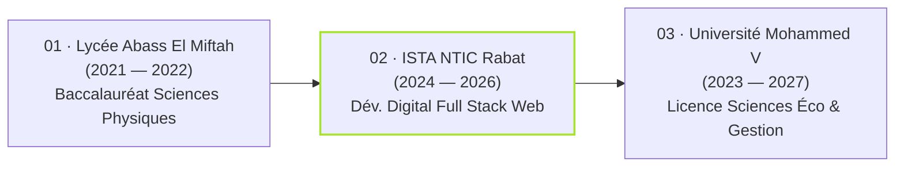

# ⚡ Cherkaoui Portfolio — Modern Animated Developer Portfolio

[](https://assurances-cherkaoui.vercel.app/)
[](https://github.com/Cherkaoui7)
[](https://www.linkedin.com/in/cherkaoui-abdessamad-750294212/)
[](https://mail.google.com/mail/?view=cm&fs=1&to=cherkaouiabdessamad9@gmail.com)

> A modern, high-performance portfolio featuring an authentic **Monokai terminal code card**, an **interactive neural plexus constellation** for education, a **dynamic tech stack mind map**, and a **zero-reload bilingual engine (English / French)**. Built with pure semantic HTML5, modern CSS3, and vanilla ES6+ JavaScript.

---

## 📑 Table of Contents

- [Overview](#-overview)
- [Key Features](#-key-features)
- [Featured Projects](#-featured-projects)
- [Interactive Sections](#-interactive-sections)
  - [Monokai Hero Code Engine](#1-monokai-hero-code-engine)
  - [Neural Plexus Network (Education)](#2-neural-plexus-network-education)
  - [Interactive Skills Mind Map](#3-interactive-skills-mind-map)
  - [Bilingual Engine (EN / FR)](#4-bilingual-engine-en--fr)
- [Education &amp; Academic Background](#-education--academic-background)
- [Tech Stack &amp; Architecture](#-tech-stack--architecture)
- [Project Structure](#-project-structure)
- [Getting Started](#-getting-started)
- [Deployment](#-deployment)
- [Contact](#-contact)

---

## 🌟 Overview

This repository hosts the official personal portfolio of **Abdessamad Cherkaoui**, Full-Stack Web Developer and AI systems enthusiast. Designed with cutting-edge visual aesthetics, glassmorphism, responsive cyber-themed typography, and micro-interactions, it showcases real-world production applications, architectural case studies, and engineering capabilities without any third-party framework overhead.

---

## 🚀 Key Features

- **⚡ Zero-Build Blazing Speed:** Hand-crafted in pure HTML5, vanilla CSS3, and modern JavaScript (ES6+). Loads instantly with 0 npm bundle latency.
- **🎨 Monokai Syntax Terminal:** Authentic Monokai code block with typing simulation, syntax tokenization, and glowing macOS window controls.
- **🧠 Interactive HTML5 Canvas Neural Network:** Dynamic particle canvas with distance-based synaptic connections and interactive mouse attraction physics.
- **🗺️ SVG Tech Stack Mind Map:** Radial interactive skills ecosystem categorizing frontend, backend, databases, and DevOps.
- **🌐 Real-Time Bilingual Toggle:** Instant client-side language switching between English and French without page reload.
- **🖱️ Precision Physics Micro-Interactions:** Custom magnetic cursor, dual-ring follower, 3D card tilt on hover, and smooth scroll progress monitoring.
- **📬 Direct Gmail Compose Workflow:** One-click contact button automatically opens a pre-addressed web Gmail draft (`cherkaouiabdessamad9@gmail.com`) bypassing legacy Outlook protocol popups.
- **📄 Native Resume Integration:** Direct download link pointing to authentic curriculum vitae.

---

## 💼 Featured Projects

| Project                        | Description                                                                                                                                                | Core Stack                                      | Repository / Live                                                                                           |
| :----------------------------- | :--------------------------------------------------------------------------------------------------------------------------------------------------------- | :---------------------------------------------- | :---------------------------------------------------------------------------------------------------------- |
| **JobFinder AI**         | AI-driven job search platform featuring Bring-Your-Own-Key (BYOK) architecture, real-time scraping, and resume-to-job matching with compatibility scoring. | React, Node.js, Mistral AI, SerpApi             | [GitHub](https://github.com/Cherkaoui7/AiJobFinder)                                                          |
| **DOMINATORES**          | Luxury 3D real estate and event planning platform with procedural dollhouse views, interactive booth reservation, and real-time floor plans.               | Laravel 10, Sanctum, React 18, Three.js         | [GitHub](https://github.com/Cherkaoui7/event)                                                                |
| **Assurances Cherkaoui** | Full-stack production insurance brokerage platform with automated quotation calculator, NodeMailer dispatch, and secure administrative dashboard.          | MongoDB, Express, React, Node.js                | [GitHub](https://github.com/Cherkaoui7/assurance_ch) · [Live Demo](https://assurances-cherkaoui.vercel.app/) |
| **AURORA Store**         | Modern eCommerce experience featuring spring-physics animations, responsive product filtering, and scalable media handling pipeline.                       | MongoDB, Express, React, Node.js, Framer Motion | [GitHub](https://github.com/Cherkaoui7/aurora_store)                                                         |
| **ArchivePro**           | Public sector digital archiving solution built for*Conseil de l'Arrondissement Agdal-Ryad* with offline-first indexing and high-volume Excel exports.    | Offline-first PWA, IndexedDB, Chart.js, SheetJS | [GitHub](https://github.com/Cherkaoui7/archive_emp)                                                          |

---

## 🔬 Interactive Sections

### 1. Monokai Hero Code Engine

An interactive hero card simulating an active code editor running on the authentic **Monokai syntax theme**:

- **Tokens:** Keywords (`#f92672`), Variables & Functions (`#a6e22e`), Object Keys (`#66d9ef`), Strings (`#e6db74`), and Comments (`#75715e`).
- **Interactive Cursor:** Animated pulsing terminal block cursor with live character injection.

### 2. Neural Plexus Network (Education)

A specialized visual representation of academic milestones rendered as a living neural network:

- **Canvas Physics:** 38 dynamic synaptic nodes connected by adaptive proximity lines with real-time mouse repulsion and connection tethering.
- **Floating Glassmorphic Hubs:** Semi-transparent cards with neon green borders, glowing accent nexus nodes, and high-contrast credential badges.

### 3. Interactive Skills Mind Map

An SVG-driven radial architecture diagram mapping technical competencies across 4 distinct branches:

- **Frontend Core:** React, Tailwind CSS, Three.js, Modern CSS3.
- **Backend Architecture:** Node.js, Express, Laravel, RESTful APIs.
- **Databases & Tools:** MongoDB, MySQL, Git, Docker, Postman.
- **Core Competencies:** Full-Stack Architecture, AI Integration, Responsive UX, PWA Development.

### 4. Bilingual Engine (EN / FR)

Integrated multilingual architecture managed through [`lang.js`](./lang.js):

- Comprehensive translation dictionary covering navigation, hero statements, project descriptions, metric badges, and contact forms.
- Preserves layout symmetry and prevents text clipping across all viewport widths.

---

## 🎓 Education & Academic Background



1. **Lycée Abass El Miftah** (2021 – 2022)*Baccalauréat en Sciences Physiques* — Strong foundation in mathematics, analytical reasoning, and scientific methodology.
2. **Institut Spécialisé de Technologie Appliquée NTIC (Rabat Hay Riad)** (2024 – 2026)*Technicien Spécialisé en Développement Digital (Option Full Stack Web)* — Comprehensive specialization in software architecture, MERN stack, Laravel, REST APIs, and database engineering *(Highest / Most Recent)*.
3. **Université Mohammed V de Rabat** (2023 – 2027)
   *Licence d'Études Fondamentales en Sciences Économiques et Gestion* — Advanced study of business analytics, organizational strategy, and financial mechanisms.

---

## 🛠 Tech Stack & Architecture

- **Markup & Semantics:** HTML5, Accessible WAI-ARIA roles, SEO OpenGraph tags.
- **Styling & Layout:** Vanilla CSS3, CSS Custom Properties (Variables), Flexbox, CSS Grid, Glassmorphism, Neon Drop Shadows.
- **Logic & Effects:** Vanilla JavaScript (ES6+), HTML5 Canvas 2D Context, SVG DOM manipulation.
- **Icons & Typography:** Devicon CDN, Google Fonts (*Inter*, *DM Mono*).
- **Deployment Target:** Static Hosting (Netlify, Vercel, GitHub Pages, Apache, NGINX).

---

## 📁 Project Structure

```text
cherkaoui-portfolio-v2-animated/
├── index.html              # Main HTML markup & section architecture
├── style.css               # Core styling, responsive layouts, Monokai theme & animations
├── script.js               # Terminal typer, neural canvas, 3D tilt & interaction scripts
├── lang.js                 # Complete bilingual dictionary & translation engine (EN/FR)
├── assets/
│   ├── ABDESSAMAD CHERKAOUI (2).pdf   # Official curriculum vitae / resume
│   └── reference-*.png                 # Design reference mockups
└── README.md               # Project documentation & overview
```

---

## 💻 Getting Started

Because this project uses pure vanilla technologies, **no build step, package manager, or compilation is required**.

### Option 1: Live Server (VS Code)

1. Open the project folder in **Visual Studio Code**.
2. Install the **Live Server** extension (`ritwickdey.liveserver`).
3. Right-click `index.html` and select **"Open with Live Server"**.

### Option 2: Python Local Server

```bash
# Python 3 (Binds directly to IPv4 localhost)
python -m http.server 8000 --bind 127.0.0.1
```

Then click or visit [http://127.0.0.1:8000](http://127.0.0.1:8000) or [http://localhost:8000](http://localhost:8000) in your web browser.

### Option 3: Node.js http-server

```bash
npx http-server . -p 8000
```

---

## 🚢 Deployment

### Deploy to Vercel

```bash
npm i -g vercel
vercel deploy
```

### Deploy to Netlify

- Drag and drop the repository folder directly into the [Netlify Drop](https://app.netlify.com/drop) console, or connect via GitHub for automated continuous deployment.

### Deploy to GitHub Pages

1. Go to repository **Settings** > **Pages**.
2. Select branch `main` and root directory `/`.
3. Save to publish instantly.

---

## 📬 Contact

- **Name:** Abdessamad Cherkaoui
- **Email:** [cherkaouiabdessamad9@gmail.com](https://mail.google.com/mail/?view=cm&fs=1&to=cherkaouiabdessamad9@gmail.com)
- **LinkedIn:** [linkedin.com/in/cherkaoui-abdessamad-750294212](https://www.linkedin.com/in/cherkaoui-abdessamad-750294212/)
- **GitHub:** [@Cherkaoui7](https://github.com/Cherkaoui7)
- **Location:** Rabat, Morocco

---

*© 2026 Abdessamad Cherkaoui. All rights reserved.*
